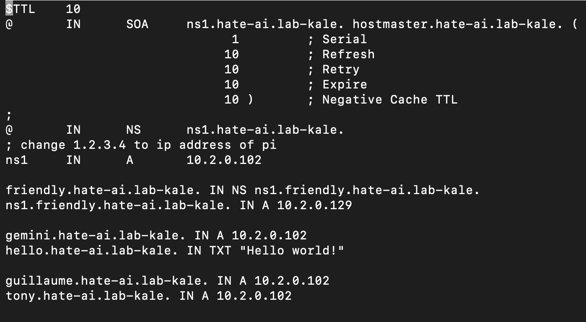
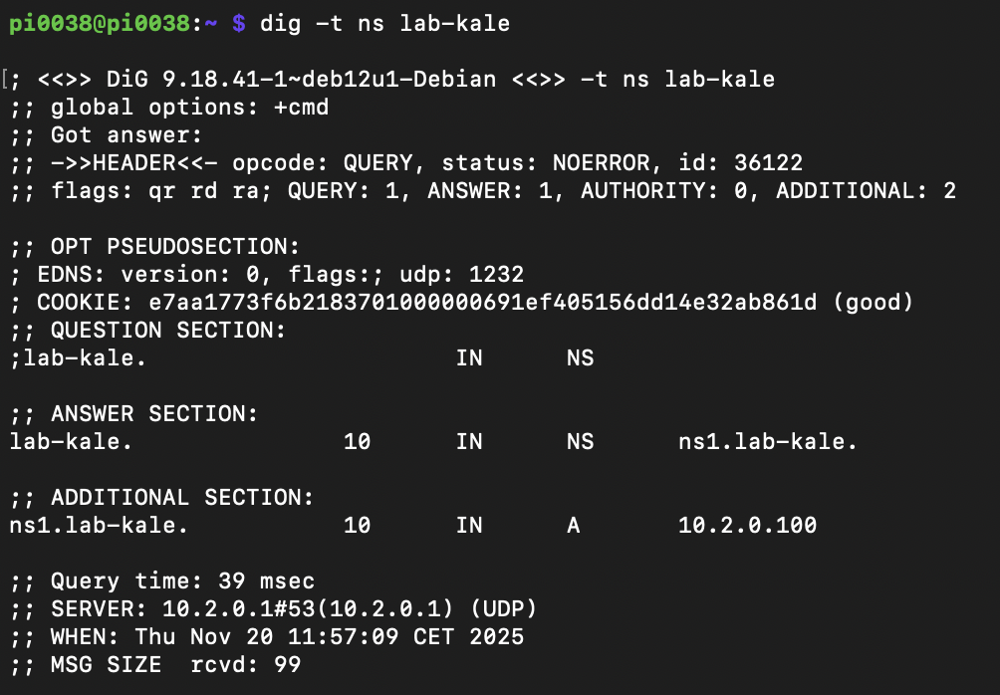
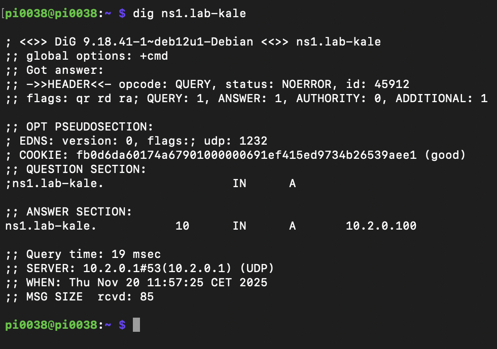
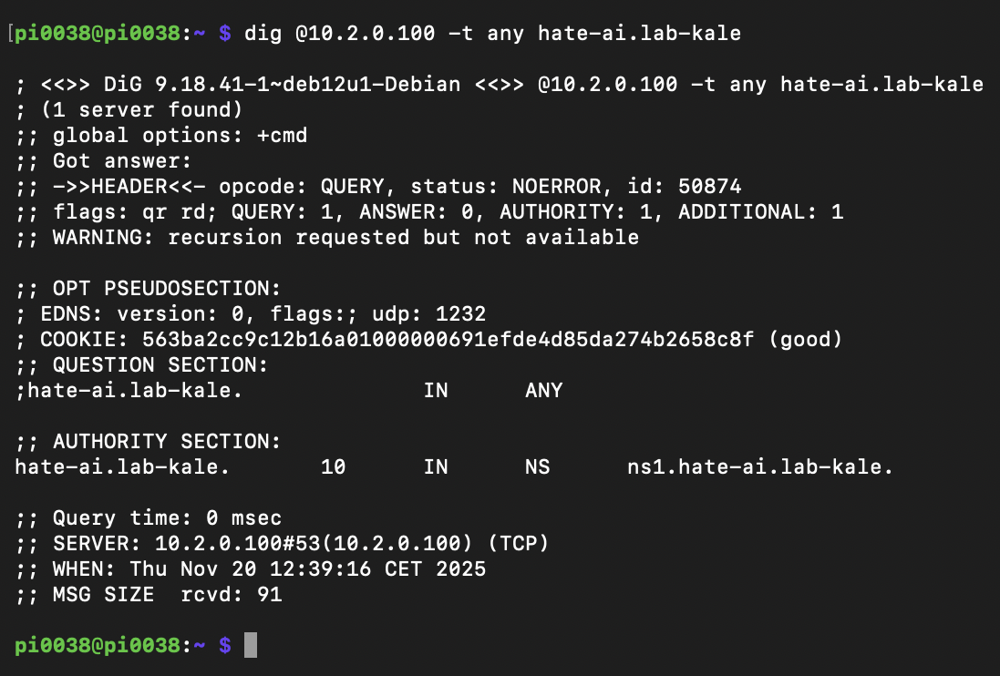
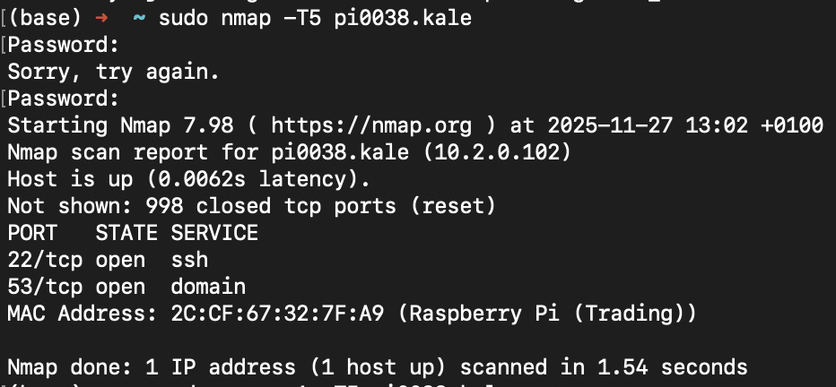
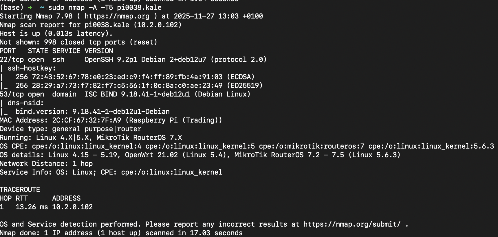

# Project Report

Author: Louis Nathan Vessah Njoya Tchuente

Email: <v.vessahnjoyatchuente@student.maastrichtuniversity.nl>

Student ID number: i6371413

## Gemini Lite Client Program

(Insert user documentation for your program here. Include command-line usage instructions.)

### Bonus enhancements

(If you attempt any bonus enhancements, document them in this section.)

## Gemini Lite Server Program

(Insert user documentation for your program here. Include command-line usage instructions.)

### Bonus enhancements

(If you attempt any bonus enhancements, document them in this section.)

## Gemini Lite Proxy Program

(Insert user documentation for your program here. Include command-line usage instructions.)

### Bonus enhancements

(If you attempt any bonus enhancements, document them in this section.)

## Test Cases

(Include at least 3 of each kind of test case here, formatted as instructed in the project manual.)

### Client test cases

### Server test cases

### Proxy test cases

## Alternative DNS, Bakeoff and Wireshark outputs

### Lab4

#### Step 1

Final content of `/var/lib/bind/db.zone.lab-kale`

#### Step 2

- Running `dig -t ns lab-kale` to retrieve all domain name server (ns) records associated with the domain lab-kale.

- Running `dig ns1.lab-kale` to retrieve the domain's ip address.

- Querying the IP address to retrieve all available dns records associated with the subdomain `hate-ai.lab-kale`

-

#### Step 5

Name: Berke
 request line: gemini-lite://boogeyman.boogle.lab-kale/test.gmi

20 text/gemini; charset=utf-8
#..Heading

regular text

=> /link

### Lab5

#### Lab 5: Packet capture of Gemini Lite™ client

1- What was the line you changed in or added to your Pi’s db.zone.lab-kale file defining the A record pointing at your laptop? Copy it into your report.

`louis.hate-ai.lab-kale. IN A 10.2.2.169`

2- In Wireshark, set the display filter to dns. Were there DNS queries in your packet capture related to the DNS name them.theirdomain.lab-kale? Copy-and-paste the request(s) and matching response(s) from the top panel into your report.

`75	10.899129	10.2.2.169	10.2.0.1	DNS	85 Standard query 0x7f8c A boogeyman.boogle.lab-kale`

`101	11.069507	10.2.0.1	10.2.2.169	DNS	101	Standard query response 0x7f8c A boogeyman.boogle.lab-kale A 10.2.0.101
`

3- Set the display filter to arp. Were there ARP requests relating to the IP address of your friend’s server? Copy-and-paste them from the top panel into your report.

`none`

4-

- What is the relative sequence number of the start of this data block?

`0`

- What is the raw sequence number of the start of this data block?

`762728800`

- What will the next relative sequence number be?

`1`

6- Look at the very next packet, coming back to the client from the server.

- What is its relative acknowledgement number?

`1`

- What is its raw acknowledgement number?

`762728801`

- How do these numbers relate to the numbers from the previous question?

`increase by 1`

7- Find the packet(s) conveying the Gemini Lite™ reply data from the server to the client

- How many of them are there in your capture? (When I did this, I had two separate packets, one with the reply line and one with the body.)

`1, when i filter for "ip.src == 10.2.0.101 && tcp.srcport == 1958 && ip.dst == 10.2.2.169 && tcp.len > 0" i get 1 packet which contains the body and the reply line (see filtered-packet.txt file under report-images folder).`

8- Find the first packet with the TCP FIN bit set.

-Is it a packet from the client or from the server

`from the client`

#### lab 5: Packet capture of joining a network

1- What are the source and destination ethernet addresses for the request packet?

`source: 5e:05:18:37:73:a2,
destination: ff:ff:ff:ff:ff:ff`

2- What are the IP source and destination addresses in the request packet?

`source: 0.0.0.0, destination: 255.255.255.255`

3- What are the UDP source and destination port numbers in the request packet?

`source: 68, destination: 67`

4- What is the value of the DHCP “Your (client) IP address” field in the request packet?

`IP: 0.0.0.0`

5- Does the request contain an Option 50 (Requested IP Address)? If so, what is the IP address being requested?

`Requested IP: 10.2.2.169`

6- What are the source and destination ethernet addresses for the ACK packet?

`source: 2c:cf:67:32:7f:67, destination: 5e:05:18:37:73:a2`

7- What are the IP source and destination addresses in the ACK packet?

`source: 10.2.0.1, destination: 10.2.2.169`

8- What are the UDP source and destination port numbers in the ACK packet?

`source: 67, destination: 68`

9- What is the value of the DHCP “Your (client) IP address” field in the ACK packet?

`IP: 10.2.2.169`

10- What are the values of the following DHCP options in the ACK packet?

`Option (1) Subnet Mask: 255.255.252.0, length: 4`

`Option (3) Router: 10.2.0.3, length: 4`

`Option (6) Domain Name Server: 10.2.0.1, length: 4`

11- Look back at Lab 2. Use the appropriate command (ip route, netstat -rn, or route print) to print out your laptop’s forwarding table. Satisfy yourself you can find the Subnet Mask and Router from the DHCP ACK packet in your machine’s forwarding table. Copy and paste the table into your report.

`unfortunately I did not answer these questions during the lab hence cannot have the subnet mask inside the route table as I am not connected to the kale network anymore`

#### lab 5: Packet capture of Gemini Lite™ server

- What is its calculated window size? If the “window scaling” TCP option was enabled during connection setup, this field will be some multiple of the raw rwnd TCP header field from this packet; otherwise, it will be the literal contents of the rwnd header field.

    `calculated window size = 65535`

- The rwnd field describes how much buffer space is available in some receive buffer. Whose receive buffer is being talked about: the client’s, or the server’s?

    `the client's receive buffer`

- Does the sequence number field describe the client-to-server bytes or the server-to-client bytes?

    `client-to-server because the tcp src port is 54806 representing a client making a request`

- Does the acknowledgement number field describe the client-to-server bytes or the server-to-client bytes?

    `server-to-client bytes`

- Find the packet(s) conveying the Gemini Lite™ reply data from the server to the client. How many of them are there in your capture?

    `3`

- When programming using TCP socket APIs, programming a client feels very different to programming a server. When you compare and contrast your two packet capture traces, one for a client and one for a server, what (if any) of that asymmetry do you notice in the on-the-wire packets? Is anything substantially different from the on-the-wire perspective about TCP acting as a server and TCP acting as a client? Why do you think this is?

    `-There is assymetry where the port corresponding to the client differs in both captures, while the port corresponding to the server is always the same (1958)`

    `- `

#### Lab 5: Port Scan

6.11-

6.22-

## Reflection on Gemini Lite

1- Compare and contrast Gemini Lite’s response codes with HTTP/1.1’s response codes. Why do you think the designer of Gemini chose to depart from the classification scheme used by HTTP?

`Gemini lite uses two digits status code as compared to HTTP/1.1 which uses three digits status codes. Gemini lite have no header, responses consists of "status code + meta + body" unlike HTTP that uses header for a better design.
Having such response format makes it easy to implement the protocol`

2- Suggest some reasons why implementing a caching proxy is challenging (or even impossible!) given the Gemini Lite specification as it stands. Caching differs from archival (see “bonus enhancements” section for the Proxy program): archival only sends its local copy of a resource if the upstream server is unavailable, while caching uses the local copy (if it is “fresh” enough) even if the upstream server is available.

`Straight forward I cannot think of a function or a way of efficiently loading a local copy while validating it against its upstream. Maybe looking at how google handles such. Hence i can say, implimenting and optimizing a validation function can be hard but doable, depends on the loading tiome constraints, say 5 seconds and you also have to display a file (due to an enhancement of the protocol), if the file was .gmi in cache and deleted from upstream, replaced by a .gif file, loading might exceed 5 seconds`

3- Is it acceptable, within the specification, for a proxy to simply relay redirections and “slow down” responses that it receives from upstream? Why or why not? Which position should the specification take on this question, in your opinion, and why?

`From the protocol specifications, it is allowed by the protocol to relay redirects between client and server using a proxy`

`The protocol should maintain relaying and recommend but not require slow down reponsses to enhance sability and efficiency while respeting current protocol specifications`

4- Imagine you are building a graphical browser for Gemtext, with clickable hyperlinks and so on. Imagine you are asked to change the overall system—this could mean any combination of changes to your client program, to gemini-lite servers, or to the gemini-lite or Gemtext protocol specifications themselves—to implement support for inline display of images in a page.

- Do you need to make changes to the gemini-lite network protocol? If so, which?

     ``

- Do you need to make changes to the Gemtext format? If so, which?

    `Maybe redefining the display of a directory, adding external links`

- Do you need to change the specification for how clients are required to behave? If so, how? Perhaps there’s an alternative interaction style that allows inline display of images while sticking to the letter of the spec?

    `clients can have other mime types reader such as a .gif reader to display it or using an external viewer in the context of a GUI client. This respects the protocol because the dislay of that .gif file is just an additional request to the server hence respecting the rules of the protocol`

5- Criticise the protocol more generally, in light of the needs of application programs as discussed in class. Does it offer reliable delivery? Does it make efficient use of available bandwidth? Is it precisely-enough specified? How could it be improved?

`I think the gemini protocol is reliable because is uses tcp to communicate between server and client hence inherits all tcp's characteristics.
In terms of bandwidth, the gemini protocol is less efficient, as there is no caching hence for every request the same data is fetched from the server insead of a cache therefore overloading of server.`

`With a basic knowledge of networks and protocols, understanding the specificatrions are easy. conventions are used to clearly define what should be done, potential improvemements. Only downside can be code strcuture (how to handle redirects, error replies while respecting SOLID principles) which was hard for me where i did not know if i should have a separate error class and depending on each engine, call that class an assign the respective error reply etc.
`
``
